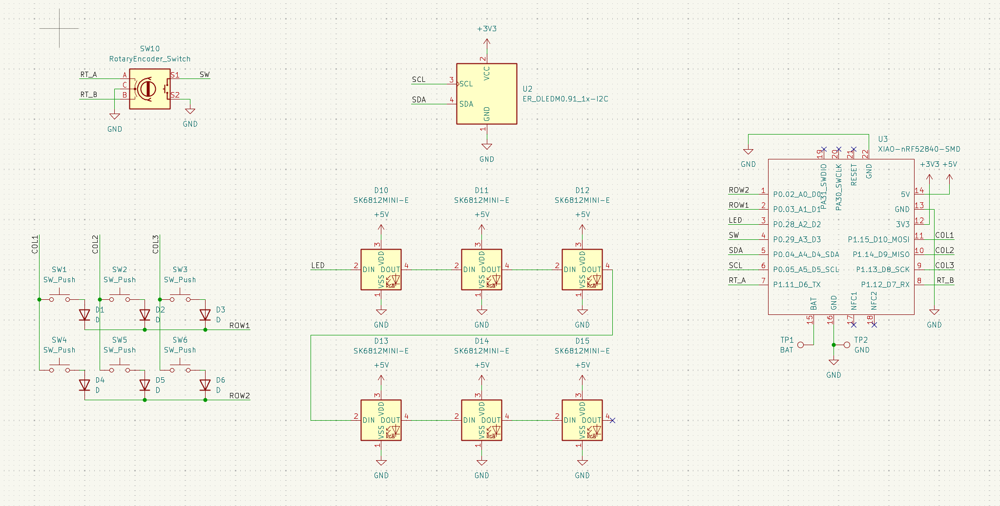
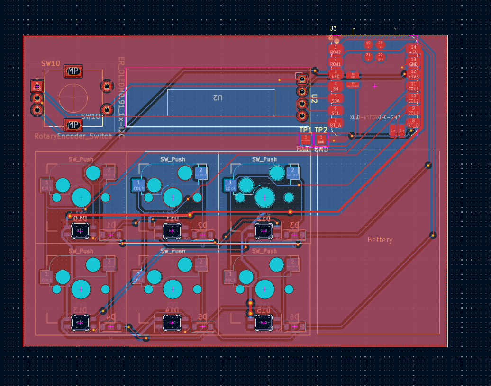
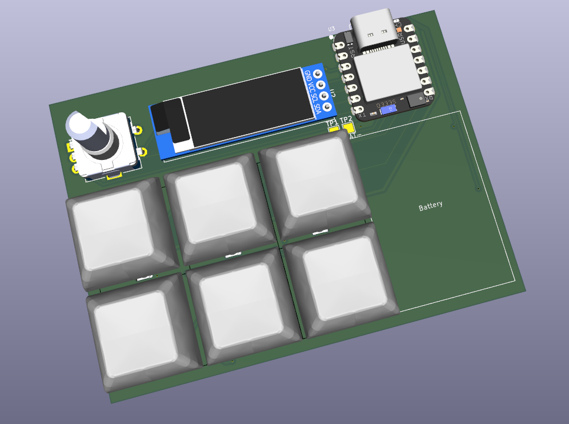
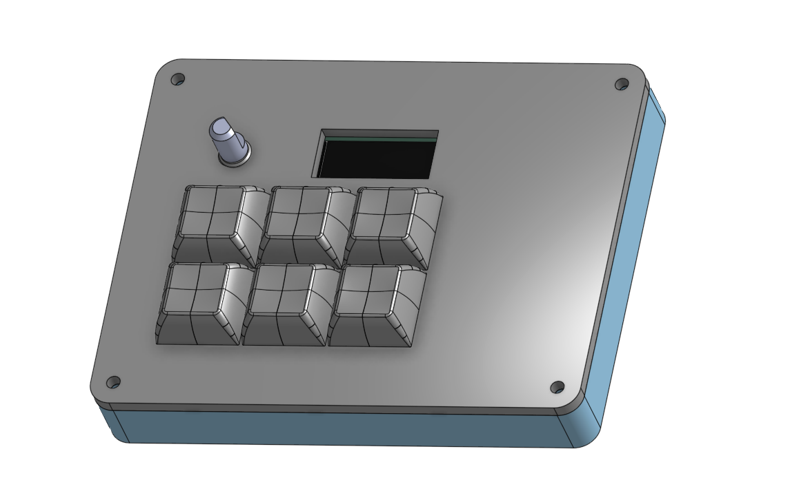

# Hackpad++
6-key hot-swappable RGB backlit macropad based on Seeed Studio Xiao NRF52840. Uses ZMK for firmware.
400mAh battery, supports wireless BLE HID operation. I made this to use up some spare parts and learn more about ZMK.

Rn the firmware is in a really really really stripped down state because I want to get the physical thing before trying to make more firmware since it keeps breaking the build

According to ZMK's [power profiler](https://zmk.dev/power-profiler) we should get about 21 hours of battery life with the RGB at 20% brightness

## Repo Structure
CAD files in `cad/`\
KiCad design files in `PCB/`\
Production gerbers in `PCB/gerbers`\
Firmware in `firmware/`\
BOM at `bom.csv`\
Case Onshape design [here](https://cad.onshape.com/documents/916857c7e80611f775a72b60/w/b9c69dbfc296334dd1ffd629/e/9b910e13e67ad3b8cb3a877d?renderMode=0&uiState=69eb64186156e8d7dafdc7be)

## 3D Models
https://grabcad.com/library/oled-0-91-128x32-1
https://grabcad.com/library/seeed-studio-xiao-nrf52840-sense-1
https://grabcad.com/library/kailh-polia-switch-cherry-mx-compatible-1
https://grabcad.com/library/11mm-metal-shaft-rotary-encoders-tht-vertical-w-push-on-switch-1
https://grabcad.com/library/dsa-keycap-for-cherry-mx-switches-1

# Assembly
Prerequisites: solder the PCB and print the case
1. put switches into sockets
2. put PCB assembly into bottom case
3. put top case over the assembly
4. screw in the top case with M3 screws
5. attach keycaps to switches
6. flash firmware according to ZMK docs
7. yay

## Cost
BOM: 17.38 USD\
PCB: 4 USD + 1.5 USD shipping\
Total: 22.88 USD

|Item              |Unit Price (AUD)|Quantity|Extended Price (AUD)|Extended Price(USD)|Notes                                  |Link                                                                                                                             |
|------------------|----------------|--------|--------------------|-------------------|---------------------------------------|---------------------------------------------------------------------------------------------------------------------------------|
|Switches          |0               |6       |0                   |0                  |Owned                                  |https://www.aliexpress.com/item/1005007983672026.html                                                                            |
|Hotswap sockets   |0               |6       |0                   |0                  |Extra from keeb                        |https://www.aliexpress.com/item/1005007232040760.html                                                                            |
|Diodes            |0               |6       |0                   |0                  |Extra from keeb                        |https://www.aliexpress.com/item/1005006323468521.html                                                                            |
|LEDs              |0               |6       |0                   |0                  |Owned - link is example                |https://www.aliexpress.com/item/1005005193716172.html                                                                            |
|Xiao              |19.25           |1       |19.25               |13.77              |ITS CHEAPER THAN ALIEXPRESS IVE CHECKED|https://core-electronics.com.au/seeed-studio-xiao-nrf52840-pre-soldered-bluetooth-5-0-ble-wireless-iot-microcontroller-board.html|
|Keycaps           |0               |6       |0                   |0                  |Owned - link is example                |https://aliexpress.com/item/1005011909872629.html                                                                                |
|OLED              |0               |1       |0                   |0                  |Owned                                  |https://www.lcsc.com/product-detail/C5248081.html                                                                                |
|Battery           |5.05            |1       |5.05                |3.61               |N/A                                    |https://core-electronics.com.au/polymer-lithium-ion-battery-400mah-38456.html                                                    |
|M3 heatset inserts|0               |4       |0                   |0                  |owned                                  |N/A                                                                                                                              |
|M3x10 screws      |0               |4       |0                   |0                  |owned                                  |N/A                                                                                                                              |
|PCB               |N/A             |1       |N/A                 |6.5                |N/A                                    |https://jlcpcb.com                                                                                                               |

## Images
### Schematic

### PCB layout

### PCB render

### Full render

### Zine page

